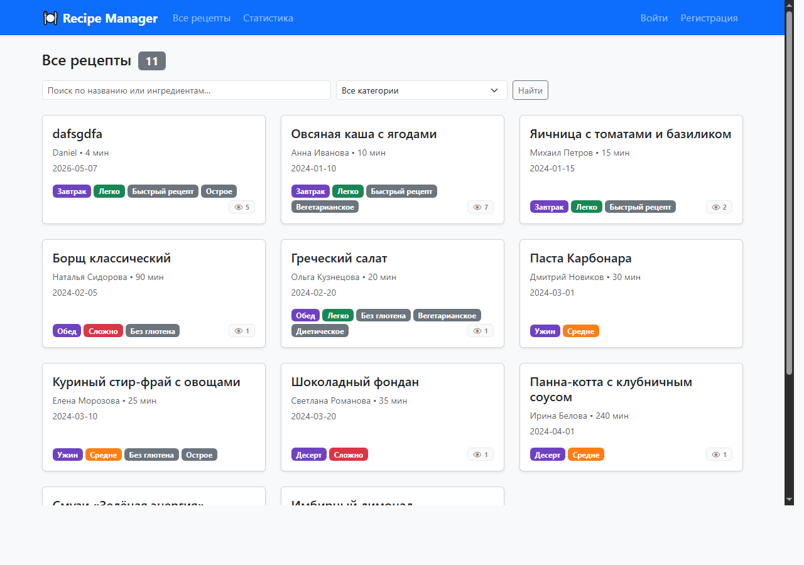
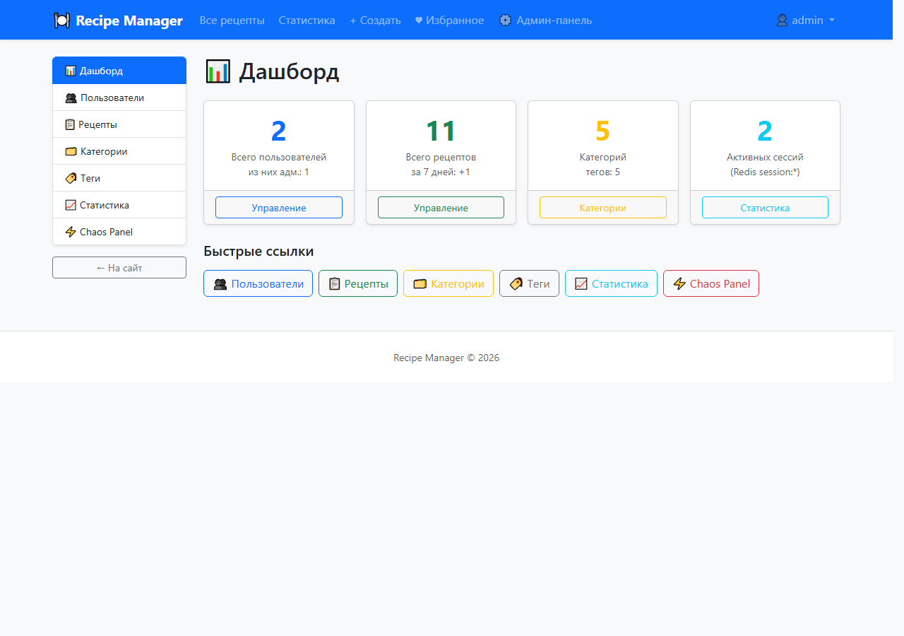
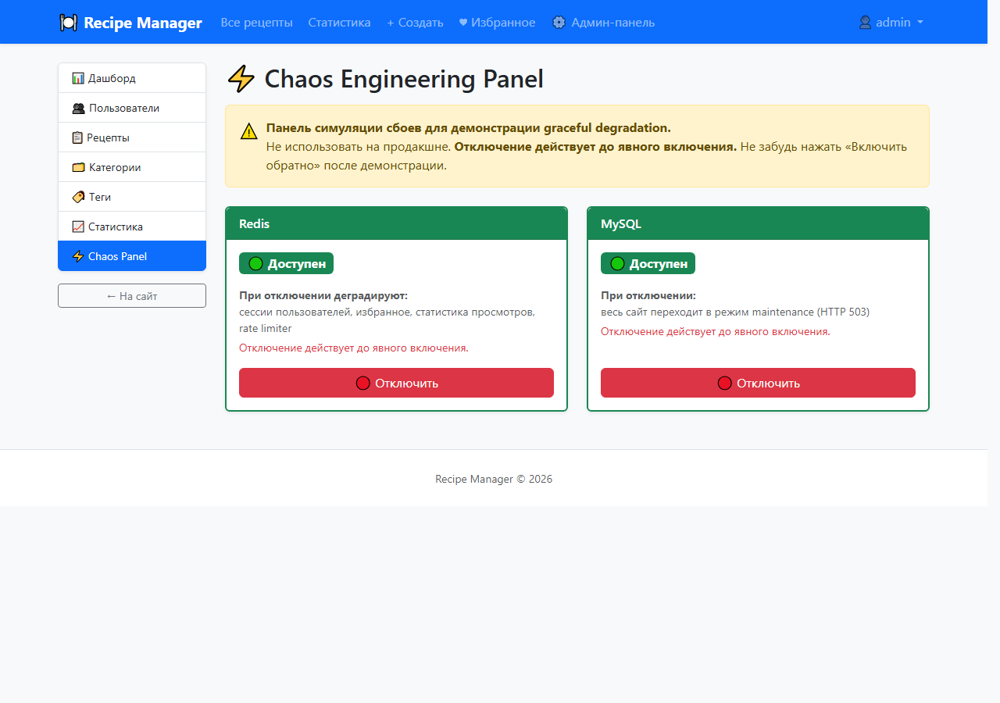
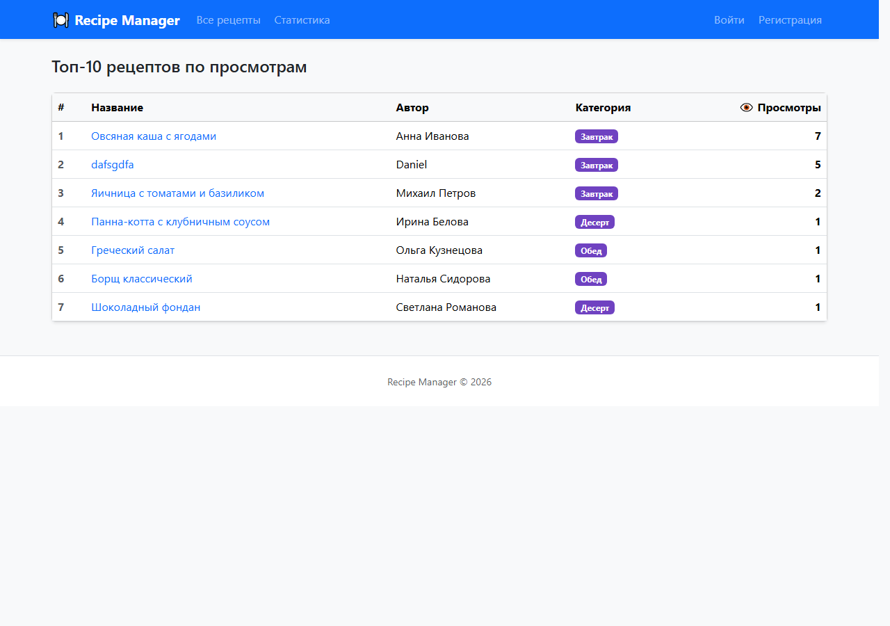

# 🍽 Recipe Manager

Веб-приложение для управления рецептами на PHP с MySQL и Redis.  
Реализовано в рамках лабораторной работы №8 и курсового проекта.


---

## Содержание

- [Описание проекта](#описание-проекта)
- [Стек технологий](#стек-технологий)
- [Функциональность](#функциональность)
- [Роли пользователей](#роли-пользователей)
- [Сценарии взаимодействия](#сценарии-взаимодействия)
- [Структура базы данных](#структура-базы-данных)
- [Схема Redis](#схема-redis)
- [Архитектура](#архитектура)
- [Безопасность](#безопасность)
- [Запуск проекта](#запуск-проекта)
- [Скриншоты](#скриншоты)
- [Ответы на контрольные вопросы](#ответы-на-контрольные-вопросы)
- [Источники](#источники)

---

## Описание проекта

Recipe Manager — многоуровневое веб-приложение для хранения, поиска и управления кулинарными рецептами, реализованное на чистом PHP 8 без фреймворков с применением двух хранилищ данных: MySQL для реляционных данных (рецепты, пользователи, категории, теги) и Redis для эфемерных данных (сессии, счётчики просмотров, избранное, rate limiting). Приложение демонстрирует концепцию Chaos Engineering — администратор может отключить Redis или MySQL через feature-flag панель и наблюдать graceful degradation: при отключённом Redis приложение продолжает работать через `NullRedisClient`, при отключённом MySQL выводится страница обслуживания (HTTP 503). Первый зарегистрированный пользователь автоматически получает роль `admin`.

---

## Стек технологий

| Технология | Версия | Назначение |
|---|---|---|
| PHP | 8.x | Серверная логика, встроенный веб-сервер |
| MySQL | 8 | Реляционное хранилище: пользователи, рецепты, категории, теги |
| Redis | 7 | Сессии, счётчики просмотров, избранное, CSRF-токены, rate limiting |
| Predis | 2.x | PHP-клиент для взаимодействия с Redis |
| vlucas/phpdotenv | 5.x | Загрузка переменных окружения из `.env` |
| Bootstrap | 5.3 | UI-фреймворк, адаптивная вёрстка, валидация форм |
| Composer | 2.x | Управление PHP-зависимостями и автозагрузка PSR-4 |

---

## Функциональность

### Для пользователей

1. **Регистрация и аутентификация** — регистрация с bcrypt-хэшированием пароля, вход по email/паролю, Redis-сессии в httpOnly cookie, автоматический выход при блокировке аккаунта. *(MySQL + Redis)*
2. **CRUD рецептов** — создание, просмотр, редактирование и удаление собственных рецептов; поля: название, автор, ингредиенты, инструкции, время, сложность, категория, теги. *(MySQL)*
3. **Категории и теги** — каждый рецепт принадлежит одной категории; поддержка тегов через связь many-to-many (`recipe_tags`), теги создаются автоматически при сохранении. *(MySQL)*
4. **Поиск и фильтрация** — фильтрация рецептов по категории и полнотекстовый поиск по названию и ингредиентам через LIKE-запрос. *(MySQL)*
5. **Избранное** — добавление/удаление рецептов в личный список избранного; хранится в Redis SET `user:{id}:favorites`, мгновенное обновление через POST/Redirect/GET. *(Redis)*
6. **Статистика просмотров** — счётчик `recipe:{id}:views` инкрементируется при каждом открытии рецепта; топ-10 популярных рецептов через Redis Sorted Set `popular:recipes`. *(Redis)*
7. **Rate limiting** — ограничение частоты запросов к формам входа и регистрации через паттерн `INCR + EXPIRE`; fail-open при недоступном Redis. *(Redis)*

### Для администраторов (дополнительно)

1. **Дашборд** — сводная статистика: кол-во пользователей, рецептов, категорий, тегов, активных Redis-сессий.
2. **Управление пользователями** — просмотр всех аккаунтов, изменение роли (user ↔ admin), блокировка/разблокировка, удаление (с защитой от удаления себя и последнего администратора), создание нового пользователя из панели.
3. **Управление рецептами** — просмотр всех рецептов системы, редактирование и удаление любого рецепта независимо от автора, фильтрация по автору и категории.
4. **Категории CRUD** — создание, переименование (inline-форма), удаление категории (запрещено если есть рецепты).
5. **Теги CRUD** — создание, переименование, удаление тега с каскадным удалением связей в `recipe_tags`.
6. **Системная статистика** — топ-10 авторов по количеству рецептов (MySQL GROUP BY), топ-10 по просмотрам (Redis), распределение рецептов по категориям с прогресс-барами, список всех Redis-ключей с типами.
7. **Chaos Engineering Panel** — симуляция отключения Redis и MySQL через feature flags (`storage/chaos.json`); демонстрация graceful degradation и страницы обслуживания HTTP 503.

---

## Роли пользователей

| Действие | Гость | Пользователь | Администратор |
|---|:---:|:---:|:---:|
| Просмотр списка рецептов | ✅ | ✅ | ✅ |
| Просмотр страницы рецепта | ✅ | ✅ | ✅ |
| Поиск и фильтрация по категории | ✅ | ✅ | ✅ |
| Регистрация / вход | ✅ | — | — |
| Создание рецепта | ❌ | ✅ | ✅ |
| Редактирование своего рецепта | ❌ | ✅ | ✅ |
| Редактирование чужого рецепта | ❌ | ❌ | ✅ |
| Удаление своего рецепта | ❌ | ✅ | ✅ |
| Удаление чужого рецепта | ❌ | ❌ | ✅ |
| Добавление в избранное | ❌ | ✅ | ✅ |
| Просмотр своего избранного | ❌ | ✅ | ✅ |
| Доступ к административной панели | ❌ | ❌ | ✅ |
| Управление пользователями (роли, блокировка) | ❌ | ❌ | ✅ |
| Управление категориями и тегами | ❌ | ❌ | ✅ |
| Просмотр системной статистики Redis | ❌ | ❌ | ✅ |
| Включение / выключение Chaos-режима | ❌ | ❌ | ✅ |

---

## Сценарии взаимодействия

### Сценарий 1 — Обычный пользователь

1. Открывает `/register.php`, вводит логин (только латиница/цифры/`_`), email и пароль ≥ 6 символов. Браузер проверяет поля через HTML5-атрибуты (`required`, `pattern`, `minlength`) до отправки.
2. После успешной регистрации перенаправляется на главную страницу `/index.php` — видит список рецептов с выпадающим фильтром по категории и строкой поиска.
3. Нажимает «+ Создать», заполняет форму рецепта: выбирает категорию из списка, отмечает теги, вводит ингредиенты и пошаговые инструкции.
4. На странице любого рецепта нажимает «⭐ В избранное» — ID рецепта добавляется в Redis SET `user:{id}:favorites`.
5. Переходит в «♥ Избранное» — видит отфильтрованный список из Redis.
6. Открывает «Статистика» (`/stats.php`) — видит топ-10 рецептов по просмотрам из Redis Sorted Set.
7. Нажимает выход — Redis-ключ сессии удаляется, cookie очищается.

### Сценарий 2 — Администратор

1. Входит через `/login.php` под учётными данными `admin@recipe.local` / `admin123`.
2. В навигационной панели появляется ссылка «⚙️ Админ-панель» — переходит на `/admin/index.php` с карточками статистики.
3. Переходит в «Пользователи», нажимает «Создать» — заполняет форму с ролью `admin`. Новый администратор появляется в таблице.
4. Переходит в «Категории», создаёт категорию «Здоровое питание» через форму, затем переименовывает существующую через inline-поле.
5. Переходит в «Статистика» — видит топ авторов по рецептам (MySQL GROUP BY), распределение по категориям с прогресс-барами и все активные Redis-ключи с типами.
6. Переходит в «Рецепты» — фильтрует по категории, находит чужой рецепт без описания, нажимает «Редактировать» и исправляет его.

### Сценарий 3 — Демонстрация отказоустойчивости

1. Администратор переходит на `/admin/chaos.php` (Chaos Engineering Panel).
2. Нажимает **«🔴 Отключить Redis»** — флаг `redis_disabled: true` записывается в `storage/chaos.json` через file-lock. Redis не останавливается физически — используется feature flag, который проверяется в `SafeRedis.__call()` перед каждым вызовом.
3. На главной странице появляется красный баннер «⚠️ DEMO MODE: Redis отключён» (автообновление каждые 10 сек). Избранное и счётчики просмотров недоступны, но страница полностью загружается — `SafeRedis` деградирует до `NullRedisClient`, все Redis-вызовы возвращают безопасные значения-заглушки.
4. Возвращается в Chaos Panel, нажимает **«✅ Включить обратно»** — флаг сбрасывается. При следующем запросе SafeRedis снова использует реальный Predis-клиент, баннер исчезает.
5. Аналогично демонстрируется отключение MySQL: весь сайт переходит в режим обслуживания (`templates/maintenance.php`, HTTP 503) и восстанавливается без перезапуска сервера.

---

## Структура базы данных

### Таблица `users`

| Поле | Тип | Описание |
|---|---|---|
| `id` | INT UNSIGNED PK AUTO_INCREMENT | Уникальный идентификатор |
| `username` | VARCHAR(50) UNIQUE NOT NULL | Логин пользователя |
| `email` | VARCHAR(255) UNIQUE NOT NULL | Электронная почта |
| `password` | VARCHAR(255) NOT NULL | Хэш пароля (bcrypt, cost 12) |
| `role` | ENUM('user','admin') DEFAULT 'user' | Роль в системе |
| `is_blocked` | TINYINT(1) DEFAULT 0 | Флаг блокировки аккаунта |
| `created_at` | TIMESTAMP DEFAULT CURRENT_TIMESTAMP | Дата регистрации |

### Таблица `categories`

| Поле | Тип | Описание |
|---|---|---|
| `id` | INT UNSIGNED PK AUTO_INCREMENT | Уникальный идентификатор |
| `name` | VARCHAR(100) UNIQUE NOT NULL | Название категории |

### Таблица `recipes`

| Поле | Тип | Описание |
|---|---|---|
| `id` | INT UNSIGNED PK AUTO_INCREMENT | Уникальный идентификатор |
| `user_id` | INT UNSIGNED FK→users NULL | Владелец (NULL если без аккаунта) |
| `title` | VARCHAR(255) NOT NULL | Название рецепта |
| `author` | VARCHAR(100) NOT NULL | Имя автора (текстовое) |
| `prep_time` | SMALLINT UNSIGNED NOT NULL | Время приготовления, минуты |
| `category_id` | INT UNSIGNED FK→categories NOT NULL | Категория (ON DELETE RESTRICT) |
| `difficulty` | ENUM('Легко','Средне','Сложно') | Уровень сложности |
| `ingredients` | TEXT NOT NULL | Список ингредиентов |
| `instructions` | TEXT NOT NULL | Пошаговые инструкции |
| `created_at` | DATE NOT NULL | Дата создания рецепта |
| `updated_at` | TIMESTAMP AUTO ON UPDATE | Дата последнего изменения |

Индексы: `idx_category (category_id)`, `idx_difficulty (difficulty)`, `idx_created (created_at)`.

### Таблица `tags`

| Поле | Тип | Описание |
|---|---|---|
| `id` | INT UNSIGNED PK AUTO_INCREMENT | Уникальный идентификатор |
| `name` | VARCHAR(100) UNIQUE NOT NULL | Название тега |

### Таблица `recipe_tags` (связь many-to-many)

| Поле | Тип | Описание |
|---|---|---|
| `recipe_id` | INT UNSIGNED FK→recipes | Составной PK; ON DELETE CASCADE |
| `tag_id` | INT UNSIGNED FK→tags | Составной PK; ON DELETE CASCADE |

### Связи между таблицами

- `users` **1:N** `recipes` — один пользователь может иметь много рецептов
- `categories` **1:N** `recipes` — одна категория объединяет много рецептов
- `recipes` **M:N** `tags` — один рецепт имеет много тегов; один тег используется в многих рецептах (через `recipe_tags`)

---

## Схема Redis

| Ключ | Тип | Значение | TTL | Назначение |
|---|---|---|---|---|
| `session:{token}` | String | `user_id` | 86 400 с (24 ч) | Идентификация сессии по httpOnly cookie |
| `csrf:{session_id}` | String | hex-токен | 3 600 с (1 ч) | CSRF-защита POST-форм |
| `user:{id}:favorites` | Set | `{recipe_id, ...}` | — | Множество избранных рецептов пользователя |
| `recipe:{id}:views` | String | целое число | — | Счётчик просмотров рецепта |
| `popular:recipes` | Sorted Set | score = views | — | Топ рецептов по просмотрам (ZREVRANGE) |
| `ratelimit:{action}:{ip}` | String | целое число | окно (сек.) | Счётчик rate limiting: INCR + EXPIRE |

---

## Архитектура

```
public/          ← Presentation: точки входа (PHP-скрипты)
├── index.php, create.php, view.php, edit.php, delete.php
├── login.php, register.php, logout.php, favorites.php, stats.php
└── admin/       ← Административный раздел (7 страниц)
    ├── index.php, users.php, recipes.php
    ├── categories.php, tags.php, system_stats.php, chaos.php

src/             ← Application: классы, бизнес-логика
├── Database/    ← Слой подключений к БД
│   ├── MySQLConnection.php   — Singleton PDO-соединения
│   ├── RedisConnection.php   — Singleton Predis-клиента
│   ├── SafeRedis.php         — Proxy: перехват ошибок Redis
│   └── NullRedisClient.php   — Null Object: no-op заглушка
├── Models/      ← Доменные объекты
│   ├── Recipe.php            — Модель рецепта
│   └── User.php              — Модель пользователя
├── Storage/     ← Repository: изоляция SQL
│   ├── StorageInterface.php
│   └── MySQLRecipeStorage.php
├── Services/    ← Бизнес-логика
│   ├── AuthService.php       — Регистрация, вход, сессии
│   ├── AdminService.php      — Операции администратора
│   ├── FavoritesService.php  — Избранное через Redis SET
│   ├── StatsService.php      — Просмотры и топ через Redis
│   ├── RateLimiter.php       — INCR + EXPIRE
│   ├── SessionStore.php      — Redis-сессии
│   └── ChaosFlags.php        — Feature flags (файловое хранилище)
├── Validators/
│   ├── RecipeValidator.php
│   └── UserValidator.php
└── Support/
    ├── Csrf.php              — CSRF-токены (Redis + SESSION fallback)
    ├── Flash.php             — Однократные flash-сообщения
    ├── View.php              — Рендерер PHP-шаблонов
    └── AdminGuard.php        — Guard: первая строка каждой admin-страницы

templates/       ← Переиспользуемые шаблоны
migrations/      ← schema.sql, seed.sql, run.php, rebuild_popular_zset.php
config/          ← config.php (читает .env через phpdotenv)
storage/         ← chaos.json (file-lock флаги)
```

**Три слоя:**

- **Presentation** (`public/`) — принимает HTTP-запросы, отображает шаблоны, не содержит бизнес-логики
- **Application** (`src/Services`, `src/Storage`, `src/Validators`) — вся бизнес-логика, валидация, доступ к данным
- **Data** — MySQL (источник правды, реляционные данные) + Redis (эфемерные данные, производительность)

**Паттерны проектирования:**

| Паттерн | Класс | Суть |
|---|---|---|
| Singleton | `MySQLConnection`, `RedisConnection` | Одно соединение на жизненный цикл запроса |
| Proxy | `SafeRedis` | Перехватывает каждый Redis-вызов, деградирует к Null Object при сбое |
| Null Object | `NullRedisClient` | Безопасные no-op ответы вместо `null`-проверок по всему коду |
| Repository | `MySQLRecipeStorage` | Инкапсулирует все SQL-запросы, возвращает доменные объекты |
| Feature Flag | `ChaosFlags` | Управляет симуляцией сбоев без остановки сервисов |
| PRG | все POST-формы | Post/Redirect/Get — предотвращает двойной сабмит |
| Guard | `AdminGuard` | Первая строка каждой admin-страницы проверяет роль |

---

## Безопасность

- **Пароли:** `password_hash($pwd, PASSWORD_BCRYPT)` с автоматическим cost 12; проверка через `password_verify()`
- **SQL-инъекции:** PDO prepared statements с `?`-плейсхолдерами во всех запросах; `PDO::ATTR_EMULATE_PREPARES = false` — настоящая подготовка на стороне MySQL
- **XSS:** `htmlspecialchars()` с `ENT_QUOTES` при каждом выводе пользовательских данных в шаблонах
- **CSRF:** скрытое поле `_token` во всех POST-формах; `Csrf::verify()` до обработки; хранится в Redis с TTL 1 ч, fallback в `$_SESSION`
- **Сессии:** httpOnly cookie + `SameSite=Lax`; токен — `bin2hex(random_bytes(32))`; TTL 24 часа в Redis
- **Rate limiting:** `RateLimiter::check()` через `INCR + EXPIRE` — ограничение попыток входа и регистрации; fail-open при недоступном Redis
- **Права доступа:** редактировать/удалять рецепт может только автор (`user_id === currentUser->id`) или администратор (`isAdmin()`)
- **Блокировка:** `is_blocked = 1` → `AuthService` принудительно разлогинивает пользователя при каждом запросе через bootstrap.php

---

## Запуск проекта

**Требования:** PHP 8.1+, MySQL 8, Redis 7, Composer

### Вариант А — локально с Docker

```bash
# Запустить MySQL и Redis
docker run -d --name recipe-mysql \
  -e MYSQL_ROOT_PASSWORD=root \
  -e MYSQL_DATABASE=recipe_manager \
  -p 3307:3306 mysql:8

docker run -d --name recipe-redis \
  -p 6379:6379 redis:alpine

# Установить зависимости
composer install

# Настроить окружение
cp .env.example .env
# Отредактировать .env (MYSQL_PORT=3307, пароли)

# Применить миграции и seed-данные
php migrations/run.php

# Запустить встроенный сервер PHP
php -S localhost:8000 -t public
```

Открыть: **http://localhost:8000**  
Войти как администратор: `admin@recipe.local` / `admin123`

### Вариант Б — на Ubuntu VPS (нативно)

```bash
apt install php8.3-cli php8.3-mysql php8.3-mbstring redis-server mysql-server

# Создать БД
mysql -u root -e "CREATE DATABASE recipe_manager CHARACTER SET utf8mb4;"
mysql -u root -e "CREATE USER 'recipe'@'localhost' IDENTIFIED BY 'пароль';"
mysql -u root -e "GRANT ALL ON recipe_manager.* TO 'recipe'@'localhost';"

# Развернуть приложение
composer install
cp .env.example .env && nano .env
php migrations/run.php
php -S 0.0.0.0:8080 -t public
```

### Переменные окружения (`.env`)

```env
MYSQL_HOST=127.0.0.1
MYSQL_PORT=3307
MYSQL_DATABASE=recipe_manager
MYSQL_USER=root
MYSQL_PASSWORD=root

REDIS_HOST=127.0.0.1
REDIS_PORT=6379

APP_ENV=dev
APP_URL=http://localhost:8000
COOKIE_SECURE=false
```

> **Примечание:** для активации Chaos Engineering Panel установите `APP_ENV=demo`.

---

## Скриншоты

### Главная страница



*Список рецептов с фильтрацией по категориям и полнотекстовым поиском*

### Административная панель



*Управление пользователями, рецептами, категориями и тегами*

### Chaos Engineering Panel



*Симуляция отказов Redis и MySQL для демонстрации graceful degradation*

### Статистика просмотров



*Топ-10 рецептов по просмотрам из Redis Sorted Set*

---

## Ответы на контрольные вопросы

### 1. Что такое PDO и чем отличается от `mysqli_*`?

**PDO (PHP Data Objects)** — абстрактный слой доступа к базам данных, предоставляющий единый интерфейс для работы с 12+ СУБД (MySQL, PostgreSQL, SQLite, MSSQL и др.). В отличие от `mysqli_*`, который жёстко привязан только к MySQL и не позволяет сменить СУБД без переписывания всего кода работы с БД, PDO достаточно изменить строку DSN. PDO поддерживает именованные параметры (`:name`) и позиционные (`?`), объектно-ориентированный интерфейс, гибкое управление режимом ошибок через `PDO::ATTR_ERRMODE`. Важное отличие — при `ERRMODE_EXCEPTION` любая ошибка SQL автоматически бросает `PDOException`, что упрощает обработку ошибок.

В проекте PDO инициализируется в `MySQLConnection::getInstance()`:

```php
$pdo = new PDO($dsn, $user, $password, [
    PDO::ATTR_ERRMODE            => PDO::ERRMODE_EXCEPTION,
    PDO::ATTR_DEFAULT_FETCH_MODE => PDO::FETCH_ASSOC,
    PDO::ATTR_EMULATE_PREPARES   => false,  // настоящая подготовка на стороне MySQL
]);
```

Отключение `EMULATE_PREPARES` заставляет MySQL выполнять подготовку запроса на стороне сервера, что исключает любую возможность SQL-инъекции на уровне протокола.

---

### 2. Что такое подготовленные выражения?

**Подготовленное выражение (prepared statement)** — запрос с параметрами-плейсхолдерами (`?` или `:name`), который компилируется СУБД один раз, а затем выполняется многократно с разными значениями. Ключевое свойство: параметры передаются отдельно от SQL-кода через бинарный протокол, поэтому пользовательский ввод никогда не интерпретируется как часть SQL-запроса — SQL-инъекция становится невозможной на уровне протокола.

В проекте все операции с пользовательскими данными используют prepared statements. Пример из `MySQLRecipeStorage`:

```php
// Поиск рецепта по ID
$stmt = $pdo->prepare(
    self::BASE_SELECT . ' WHERE r.id = ? GROUP BY r.id'
);
$stmt->execute([$id]);
$row = $stmt->fetch();
```

Значение `$id` передаётся как связанный параметр и никогда не конкатенируется в строку запроса, что гарантирует безопасность независимо от его содержимого.

---

### 3. Что такое транзакция и когда её использовать?

**Транзакция** — атомарная последовательность операций с базой данных: либо все они выполняются успешно (`COMMIT`), либо все откатываются к исходному состоянию (`ROLLBACK`). Транзакции обеспечивают ACID-свойства: атомарность, согласованность, изолированность и долговечность. Применяются когда несколько связанных таблиц должны обновляться как единое целое — частичное выполнение оставило бы данные в несогласованном состоянии.

Классический пример в проекте — сохранение рецепта в `MySQLRecipeStorage::save()`: сначала `INSERT` в таблицу `recipes`, затем `DELETE + INSERT` в `recipe_tags`. Если вставка тегов упадёт с ошибкой, рецепт без тегов останется в БД. Транзакция исключает эту ситуацию:

```php
$this->pdo->beginTransaction();
try {
    $this->pdo->prepare('INSERT INTO recipes ...')->execute([...]);
    $recipeId = (int) $this->pdo->lastInsertId();
    $this->syncTags($recipeId, $recipe->tags);  // может бросить PDOException
    $this->pdo->commit();
} catch (\PDOException $e) {
    $this->pdo->rollBack();  // откатывает и INSERT в recipes
    throw $e;
}
```

---

### 4. Чем отличается `fetch()` от `fetchAll()`?

**`fetch()`** читает одну строку из курсора результата и перемещает внутренний указатель вперёд. Строки не загружаются в память сразу — это важно при работе с большими результирующими наборами. Если нужна только одна запись (поиск по ID, проверка существования), `fetch()` экономит память и не загружает лишние данные.

**`fetchAll()`** считывает все строки в массив PHP за один вызов. Удобно для небольших выборок (списки категорий, теги), но при больших таблицах весь результат оказывается в памяти PHP одновременно.

Использование в проекте:

```php
// fetch() — ожидаем одну строку (поиск пользователя при входе)
$stmt = $pdo->prepare('SELECT * FROM users WHERE email = ? LIMIT 1');
$stmt->execute([$email]);
$row = $stmt->fetch();  // одна строка или false

// fetchAll() — список рецептов для отображения на главной
$stmt = $pdo->query(self::BASE_SELECT . ' GROUP BY r.id ORDER BY r.updated_at DESC');
return array_map(
    fn($row) => Recipe::fromArray($this->mapRow($row)),
    $stmt->fetchAll()
);
```

---

## Источники

1. **PHP Documentation** — https://www.php.net/docs.php
2. **PDO Manual** — https://www.php.net/manual/en/book.pdo.php
3. **Redis Documentation** — https://redis.io/docs
4. **Predis — PHP Redis client** — https://github.com/predis/predis
5. **Bootstrap 5.3 Documentation** — https://getbootstrap.com/docs/5.3
6. **OWASP SQL Injection Prevention** — https://owasp.org/www-community/attacks/SQL_Injection
7. **OWASP CSRF Prevention Cheat Sheet** — https://cheatsheetseries.owasp.org/cheatsheets/Cross-Site_Request_Forgery_Prevention_Cheat_Sheet.html
8. **PHP-FIG PSR-4 Autoloading Standard** — https://www.php-fig.org/psr/psr-4/
